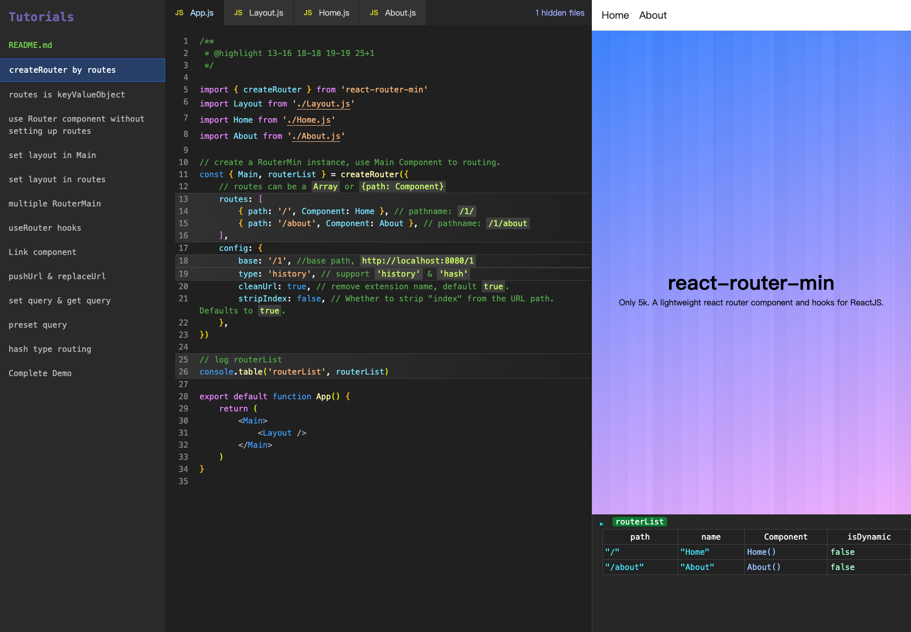

# react-router-simple

Only 5k. A lightweight react router component and hooks for ReactJS.

## Usage

```shell
npm install react-router-min
```

### ES Module

```javascript
// App.js
import { createRouter } from 'react-router-min'

const { Main } = createRouter({
    routes: [{ path: '/', Component: Home }],
    config: { type: 'history', cleanUrl: true, stripIndex: false },
})

function App() {
    return <Main />
}
```

### UMD file

```html
<script src="https://unpkg.com/react-router-min/lib/index.umd.js"></script>
```

## Learn by Demos

Follow tutorial to learn how to use `react-router-min`

```shell
git clone https://github.com/billypc025/react-router-min.git
cd react-router-min && npm install
npm run demo
```



## Reference

### createRouter

`react-router-min` supports multiple router instances. Use `createRouter` to create a router instance, and each instance works independently.

```javascript
import { createRouter } from 'react-router-min'

// create Router instance
const {
    Link, // create a Link component
    Main, // create Router Main component
    Router, // create Router component
    useRouter, // create a useRouter Hooks (Can obtain the parsed `path` and `query`)
    pushUrl, // push state url for function call
    replaceUrl, // replace state url for function call
    routerList, // generate a path list based on routes
} = createRouter({ routes, config })
```

#### Configuring Routes

routes can be Array of Record, routes is not required.

```javascript
// Array type, with children
createRouter({
    routes: [
        {
            path: '/',
            Component: Root,
            children: [
                { index: true, Component: Home },
                { path: 'about', Component: About },
                {
                    path: 'auth',
                    Component: AuthLayout,
                    children: [
                        { path: 'login', Component: Login },
                        { path: 'register', Component: Register },
                    ],
                },
                {
                    path: 'concerts',
                    children: [
                        { index: true, Component: ConcertsHome },
                        { path: ':city', Component: ConcertsCity },
                        { path: 'trending', Component: ConcertsTrending },
                    ],
                },
            ],
        },
    ],
})
```

```javascript
// Flattened Array
createRouter({
    routes: [
        { path: '/', Component: Home },
        { path: '/about', Component: About },
        { path: '/auth', Component: AuthLayout },
        { path: '/auth/login', Component: Login },
        { path: '/auth/register', Component: Register },
        { path: '/concerts/', Component: ConcertsHome },
        { path: '/concerts/city', Component: ConcertsCity },
        { path: '/concerts/trending', Component: ConcertsTrending },
    ],
})
```

```javascript
// Record type
createRouter({
    routes: {
        '/': Home,
        '/about': About,
        '/auth': AuthLayout,
        '/auth/login': Login,
        '/auth/register': Register,
        '/concerts/': ConcertsHome,
        '/concerts/city': ConcertsCity,
        '/concerts/trending': ConcertsTrending,
    },
})
```

**dynamic routes**

1. Bind path to `VariableName`

```javascript
// URL:  https://domain.com/foo/1/article?id=xxxxx

//-- routes --
const routes = { '/foo/[category]/article': ArticleComponent }

//-- ArticleComponent.js --
function ArticleComponent({ category }) {
    console.log(category)
    //=> '1'

    return '...'
}
```

2. path is `SegmentName`

```javascript
// URL:  https://domain.com/foo/1/2/article?id=xxxxx

//-- routes --
const routes = { '/foo/[...tags]/article': ArticleComponent }

//-- ArticleComponent.js --
function ArticleComponent({ tags }) {
    console.log(tags)
    //=> ['1', '2']

    return '...'
}
```

#### Configuration for the router behavior

```javascript
const { Main } = createRouter({
    config: { base: '', type: 'history', cleanUrl: true, stripIndex: true },
})
```

-   `config.base` router base pathname. Defaults to `''`, useful for Micro-FE.

-   `config.presetQuery` preset query record, forever existing, can be covered.

-   `config.type` The type of routing to use, either 'history' or 'hash'. Defaults to `'history'`

-   `config.cleanUrl` Whether to clean the URL by removing extension name. Defaults to `true`.

-   `config.stripIndex` Whether to strip "index" from the URL path. Defaults to `true`.

### Main component

The page component must be wrapped by the Main component.

```javascript
const { Main } = createRouter({ routes })

function App() {
    return (
        <Main>
            <Layout />
        </Main>
    )
}
```

### Link component

Link component return `<a/>`, but prevented default event to make SPA. Usage is same as `<a/>`.

There are two ways to import.

1.  import from instance return by creatRouter (recommend)

    ```javascript
    //-- AppRouter.js --
    import { createRouter } from 'react-router-min'

    const { Main, Link } = createRouter()
    export { Link, Main as default }
    ```

    ```javascript
    //-- PageComponent.js --
    import { Link } from './AppRouter.js'

    function PageComponent() {
        return (
            <>
                <Link href='/foo'>foo</Link>
                
                {/* replace state link */}
                <Link href='/foo' type="replace">foo</Link>

                {/* with query */}
                <Link href='/foo?n=1'>foo</Link>
                <Link href='/foo' query={{ a:1 }}>foo</Link>
            </>
        )
    }
    ```

2.  import directly from `'react-router-min'`

    ```javascript
    import { Link } from 'react-router-min'

    function PageComponent() {
        return (
            <>
                <Link href='/foo'>foo</Link>

                {/* replace state link */}
                <Link href='/foo' type="replace">foo</Link>

                {/* with query  */}
                <Link href='/foo?n=1'>foo</Link>
                <Link href='/foo' query={{ a:1 }}>foo</Link>

                {/* need to manually pass base  */}
                <Link href='/foo' options={{ base: '/base' }}>foo</Link>

                {/* need to manually pass router type */}
                <Link href='/foo' options={{ type: 'hash' }}>foo</Link>
            </>
        )
    }
    ```

### useRouter hooks

1. useRouter Hooks can obtain the parsed `path` and `query`

```javascript
// URL: https://domain.com/foo?a=1

function PageComponent() {
    const { path, query } = useRouter()

    console.log({ path, query })
    // => { path: '/foo', query: { a: 1 } }

    return '...'
}
```

2. hash type router

```javascript
// URL: https://domain.com/#/foo?a=1

function PageComponent() {
    const { path, query } = useRouter()

    console.log({ path, query })
    // => { path: '/foo', query: { a: 1 } }

    return '...'
}
```

3. When the base is set, path starts from after the base.

```javascript
// URL: https://domain.com/base/foo?a=1

//-- router.js --
const { Main } = createRouter({ routes, config: { base: '/base' } })

//-- PageComponent.js --
function PageComponent() {
    const { path, query } = useRouter()

    console.log({ path, query })
    // => { path: '/foo', query: { a: 1 } }

    return '...'
}
```

### pushUrl & replaceUrl

Function to push or replace a new URL to the history stack. There are two ways to import.

1. import from instance return by creatRouter (recommend)

    imported in this way will automatically apply the config preset by creatRouter

    ```javascript
    //-- AppRouter.js --
    import { createRouter } from 'react-router-min'

    const { Main, pushUrl } = createRouter({
        routes: [
            { path: '/', Component: Home },
            { path: '/foo', name: 'foo', Component: PageComponent },
        ],
    })
    export { pushUrl, Main as default }
    ```

    ```javascript
    //-- function call in PageComponent --
    import { pushUrl } from './AppRouter.js'

    pushUrl('/foo')

    pushUrl('/foo?a=1')

    pushUrl('/foo?a=1', { query: { b: 2 } })

    pushUrl({ path: '/foo', query: { a: 1 } })

    pushUrl({ name: 'foo', query: { a: 1 } }) // by name
    ```

    usage of replaceURL is the same as pushURL.

2. import directly from `'react-router-min'`

    imported in this way, need to manually pass some configurations.

    ```javascript
    import { pushUrl } from 'react-router-min'

    pushUrl('/foo')

    pushUrl('/foo?a=1')

    pushUrl('/foo?a=1', { query: { b: 2 } })

    pushUrl({ path: '/foo', query: { a: 1 } })

    pushUrl({ name: 'foo', query: { a: 1 } }) // by name

    // need to manually pass base
    pushUrl('/foo', { base: '/base' })

    // need to manually pass router type
    pushUrl('/foo', { type: 'hash' })
    ```
